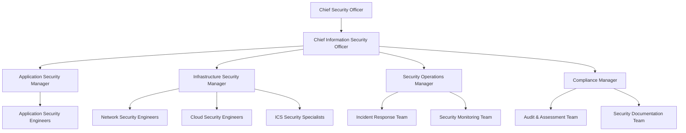

# Security Roles and Responsibilities

This document defines the security roles and responsibilities across the Cloud Infrastructure Platform organization. Clear definition of security responsibilities is critical for maintaining our security posture, incident response capabilities, and ensuring compliance with regulatory requirements.

## Contents

- Additional Security Roles
- Annual Security Role Reviews
- Approvals and Authority Levels
- Compliance and Risk Roles
- Cross-Functional Security Roles
- Executive Security Roles
- Infrastructure Security Roles
- References
- Role-Based Security Responsibilities
- Security Application Roles
- Security Operations Roles
- Security Organization Structure
- Security Responsibilities Matrix
- Version History

## Security Organization Structure

## Executive Security Roles

### Chief Information Security Officer (CISO)

**Primary Responsibilities:**

- Day-to-day leadership of information security program
- Development and implementation of security policies
- Management of security teams and initiatives
- Regular security reporting to CSO and executive team
- Security strategy aligned with business objectives

**Direct Reports:**

- Application Security Manager
- Compliance Manager
- Infrastructure Security Manager
- Security Operations Manager

### Chief Security Officer (CSO)

**Primary Responsibilities:**

- Final authority on security matters across physical and information security
- Management of security risk at the enterprise level
- Security budget allocation and resource approval
- Security representation at executive leadership and board level
- Strategic direction for the organization's overall security program

**Direct Reports:**

- Chief Information Security Officer (CISO)
- Physical Security Director
- Security Risk Management Director

## Security Operations Roles

### Security Incident Response Team Lead

**Primary Responsibilities:**

- Coordination of incident handling activities
- Development and maintenance of incident response procedures
- Leadership of the Computer Security Incident Response Team (CSIRT)
- Management of incident response tools and resources
- Post-incident reviews and process improvements

**Reports to:** Security Operations Manager

### Security Monitoring Team Lead

**Primary Responsibilities:**

- Alert triage and escalation procedures
- Continuous improvement of detection capabilities
- Development and tuning of detection rules
- Management of security monitoring systems
- Security metrics and reporting

**Reports to:** Security Operations Manager

### Security Operations Manager

**Primary Responsibilities:**

- Coordination of incident response activities
- Management of security tools and technologies
- Oversight of security monitoring and operations
- Security operations center (SOC) management
- Threat intelligence program leadership

**Reports to:** CISO

## Infrastructure Security Roles

### Cloud Security Engineer

**Primary Responsibilities:**

- Cloud access management and privilege reviews
- Cloud compliance and security controls
- Cloud security architecture and design
- Development of cloud security automation
- Security of cloud infrastructure across providers

**Reports to:** Infrastructure Security Manager

### ICS Security Specialist

**Primary Responsibilities:**

- ICS security monitoring and incident response
- ICS vulnerability management
- ICS-specific threat analysis and mitigation
- Implementation of ICS security controls
- Security of industrial control systems

**Reports to:** Infrastructure Security Manager

### Infrastructure Security Manager

**Primary Responsibilities:**

- Development and implementation of security architecture
- Infrastructure hardening standards and procedures
- Management of infrastructure security team
- Oversight of vulnerability management program
- Security of network, cloud, and system infrastructure

**Reports to:** CISO

### Network Security Engineer

**Primary Responsibilities:**

- Firewall and network device security management
- Network security architecture and design
- Network security testing and validation
- Network traffic monitoring and analysis
- Security configuration of network infrastructure

**Reports to:** Infrastructure Security Manager

## Application Security Roles

### Application Security Engineer

**Primary Responsibilities:**

- Application penetration testing
- Application vulnerability tracking and remediation
- Integration of security into CI/CD pipeline
- Security code reviews and assessments
- Security guidance for development teams

**Reports to:** Application Security Manager

### Application Security Manager

**Primary Responsibilities:**

- Application security testing program management
- Secure coding guidance and standards
- Secure development lifecycle implementation
- Security of applications and development processes
- Security requirements for new development

**Reports to:** CISO

### Security Architect

**Primary Responsibilities:**

- Design of secure systems and applications
- Development of security architecture patterns
- Integration of security across system components
- Security review of system designs
- Security technology evaluation and selection

**Reports to:** Application Security Manager

## Compliance and Risk Roles

### Compliance Manager

**Primary Responsibilities:**

- Coordination of compliance activities and assessments
- Development of compliance documentation
- Liaison with auditors and assessors
- Management of compliance program (ISO 27001, SOC 2, etc.)
- Regulatory requirement tracking and implementation

**Reports to:** CISO

### Security Audit Lead

**Primary Responsibilities:**

- Documentation of audit findings
- Gap analysis against requirements
- Internal security audits and assessments
- Security control testing and validation
- Tracking of remediation activities

**Reports to:** Compliance Manager

### Security Documentation Specialist

**Primary Responsibilities:**

- Creation and updating of security guidelines
- Development and maintenance of security documentation
- Documentation of security controls
- Maintenance of the security documentation repository
- Security policy and procedure management

**Reports to:** Compliance Manager

## Additional Security Roles

### Data Protection Officer (DPO)

**Primary Responsibilities:**

- Data breach notification processes
- GDPR compliance management
- Oversight of privacy compliance program
- Privacy awareness and training
- Privacy impact assessments

**Reports to:** Legal Department (dotted line to CISO)

### Security Education and Awareness Lead

**Primary Responsibilities:**

- Development of security awareness materials
- Management of security training program
- Phishing simulation exercises
- Security awareness campaigns
- Tracking of training completion

**Reports to:** Compliance Manager

## Cross-Functional Security Roles

### DevSecOps Engineer

**Primary Responsibilities:**

- Collaboration between security and development teams
- Integration of security into CI/CD pipelines
- Security as code implementation
- Security automation in development workflows
- Security testing in build processes

**Reports to:** DevOps Manager (dotted line to Application Security Manager)

### Security Champions

**Primary Responsibilities:**

- First point of contact for security questions
- Preliminary security reviews of features
- Promotion of security within development teams
- Security advocate in agile planning
- Security knowledge sharing within team

**Reports to:** Development Manager (dotted line to Application Security Manager)

## Security Responsibilities Matrix

### RACI Matrix for Key Security Processes

| Process | CSO | CISO | App Sec | Infra Sec | Sec Ops | Compliance | DevOps | IT | Development |
| --- | --- | --- | --- | --- | --- | --- | --- | --- | --- |
| **Access Management** | I | A | C | R | C | C | I | R | I |
| **Change Management** | I | A | C | C | C | C | R | R | R |
| **Compliance Activities** | A | R | C | C | C | R | I | C | C |
| **Incident Response** | I | A | C | C | R | C | C | C | C |
| **Penetration Testing** | I | A | R | C | C | I | I | I | I |
| **Risk Assessments** | A | R | C | C | C | R | I | C | C |
| **Security Architecture** | I | A | R | R | C | C | C | C | C |
| **Security Monitoring** | I | A | I | C | R | I | C | C | I |
| **Security Policies** | A | R | C | C | C | C | I | I | I |
| **Security Strategy** | A/R | R | C | C | C | C | I | I | I |
| **Security Training** | I | A | C | C | C | R | I | I | I |
| **Vulnerability Management** | I | A | R | R | R | I | C | C | C |

### Legend

R = Responsible, A = Accountable, C = Consulted, I = Informed

## Role-Based Security Responsibilities

### All Staff

- Complete security awareness training
- Follow security policies and procedures
- Maintain physical security of facilities and equipment
- Practice good security hygiene (password management, etc.)
- Protect confidential information in their possession
- Report security incidents promptly

### Developers

- Address identified security vulnerabilities
- Consult with security team on security questions
- Implement required security controls in applications
- Participate in security code reviews
- Test security functionality before release
- Write secure code following security coding standards

### Security Team (All Members)

- Apply security best practices in their domain
- Contribute to continuous improvement of security program
- Document security activities and findings
- Participate in incident response when needed
- Share security knowledge across the organization
- Stay current on security threats and vulnerabilities

### System Administrators

- Apply security patches in a timely manner
- Implement access controls according to least privilege
- Implement security configurations according to hardening guidelines
- Maintain system security documentation
- Monitor systems for security events
- Participate in incident response activities when needed

## Approvals and Authority Levels

| Security Decision | Authority |
| --- | --- |
| Risk Acceptance (High) | CSO, CIO, Business Owner |
| Risk Acceptance (Low) | Security Manager, Business Owner |
| Risk Acceptance (Medium) | CISO, Business Owner |
| Security Architecture Changes | CISO, Security Architecture Board |
| Security Configuration Changes | Security Engineer, Team Lead |
| Security Exception (Major) | CISO, Security Manager, Business Owner |
| Security Exception (Minor) | Security Manager, Team Lead |
| Security Incident Declaration | Security Operations Manager, CISO |
| Security Policy Approval | CSO, CISO, Executive Leadership |
| Security Tool Acquisition | CISO, Security Managers |

## Annual Security Role Reviews

All security roles and responsibilities are reviewed annually to ensure:

1. Documentation is current and accurate
2. Necessary authority is granted for each role
3. Responsibilities are clearly defined and understood
4. Roles remain appropriate for the organization's needs
5. Separation of duties is maintained

## References

- Corporate Security Policy
- ISO 27001 - Section A.6: Organization of Information Security
- NIST Cybersecurity Framework - Governance Functions
- Security Operations Charter

## Version History

| Version | Date | Description | Author |
| --- | --- | --- | --- |
| 1.0 | 2023-09-01 | Initial document | Security Documentation Team |
| 1.1 | 2023-12-15 | Added ICS Security roles | Security Documentation Team |
| 1.2 | 2024-02-10 | Updated RACI matrix | Compliance Manager |
| 1.3 | 2024-07-20 | Reorganized document to follow alphabetical ordering | Documentation Team |
