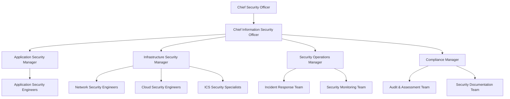

```markdown
# Security Roles and Responsibilities

This document defines the security roles and responsibilities across the Cloud Infrastructure Platform organization. Clear definition of security responsibilities is critical for maintaining our security posture, incident response capabilities, and ensuring compliance with regulatory requirements.

## Security Organization Structure



## Executive Security Roles

### Chief Security Officer (CSO)

**Primary Responsibilities:**

- Strategic direction for the organization's overall security program
- Final authority on security matters across physical and information security
- Security representation at executive leadership and board level
- Security budget allocation and resource approval
- Management of security risk at the enterprise level

**Direct Reports:**

- Chief Information Security Officer (CISO)
- Physical Security Director
- Security Risk Management Director

### Chief Information Security Officer (CISO)

**Primary Responsibilities:**

- Day-to-day leadership of information security program
- Development and implementation of security policies
- Security strategy aligned with business objectives
- Management of security teams and initiatives
- Regular security reporting to CSO and executive team

**Direct Reports:**

- Application Security Manager
- Infrastructure Security Manager
- Security Operations Manager
- Compliance Manager

## Security Operations Roles

### Security Operations Manager

**Primary Responsibilities:**

- Oversight of security monitoring and operations
- Management of security tools and technologies
- Coordination of incident response activities
- Security operations center (SOC) management
- Threat intelligence program leadership

**Reports to:** CISO

### Security Incident Response Team Lead

**Primary Responsibilities:**

- Leadership of the Computer Security Incident Response Team (CSIRT)
- Development and maintenance of incident response procedures
- Coordination of incident handling activities
- Management of incident response tools and resources
- Post-incident reviews and process improvements

**Reports to:** Security Operations Manager

### Security Monitoring Team Lead

**Primary Responsibilities:**

- Management of security monitoring systems
- Development and tuning of detection rules
- Alert triage and escalation procedures
- Security metrics and reporting
- Continuous improvement of detection capabilities

**Reports to:** Security Operations Manager

## Infrastructure Security Roles

### Infrastructure Security Manager

**Primary Responsibilities:**

- Security of network, cloud, and system infrastructure
- Development and implementation of security architecture
- Infrastructure hardening standards and procedures
- Oversight of vulnerability management program
- Management of infrastructure security team

**Reports to:** CISO

### Network Security Engineer

**Primary Responsibilities:**

- Network security architecture and design
- Firewall and network device security management
- Security configuration of network infrastructure
- Network traffic monitoring and analysis
- Network security testing and validation

**Reports to:** Infrastructure Security Manager

### Cloud Security Engineer

**Primary Responsibilities:**

- Security of cloud infrastructure across providers
- Cloud security architecture and design
- Development of cloud security automation
- Cloud compliance and security controls
- Cloud access management and privilege reviews

**Reports to:** Infrastructure Security Manager

### ICS Security Specialist

**Primary Responsibilities:**

- Security of industrial control systems
- ICS-specific threat analysis and mitigation
- Implementation of ICS security controls
- ICS vulnerability management
- ICS security monitoring and incident response

**Reports to:** Infrastructure Security Manager

## Application Security Roles

### Application Security Manager

**Primary Responsibilities:**

- Security of applications and development processes
- Secure development lifecycle implementation
- Application security testing program management
- Secure coding guidance and standards
- Security requirements for new development

**Reports to:** CISO

### Application Security Engineer

**Primary Responsibilities:**

- Security code reviews and assessments
- Application penetration testing
- Security guidance for development teams
- Integration of security into CI/CD pipeline
- Application vulnerability tracking and remediation

**Reports to:** Application Security Manager

### Security Architect

**Primary Responsibilities:**

- Design of secure systems and applications
- Development of security architecture patterns
- Security review of system designs
- Security technology evaluation and selection
- Integration of security across system components

**Reports to:** Application Security Manager

## Compliance and Risk Roles

### Compliance Manager

**Primary Responsibilities:**

- Management of compliance program (ISO 27001, SOC 2, etc.)
- Coordination of compliance activities and assessments
- Development of compliance documentation
- Regulatory requirement tracking and implementation
- Liaison with auditors and assessors

**Reports to:** CISO

### Security Audit Lead

**Primary Responsibilities:**

- Internal security audits and assessments
- Security control testing and validation
- Gap analysis against requirements
- Documentation of audit findings
- Tracking of remediation activities

**Reports to:** Compliance Manager

### Security Documentation Specialist

**Primary Responsibilities:**

- Development and maintenance of security documentation
- Security policy and procedure management
- Documentation of security controls
- Creation and updating of security guidelines
- Maintenance of the security documentation repository

**Reports to:** Compliance Manager

## Additional Security Roles

### Data Protection Officer (DPO)

**Primary Responsibilities:**

- Oversight of privacy compliance program
- GDPR compliance management
- Privacy impact assessments
- Data breach notification processes
- Privacy awareness and training

**Reports to:** Legal Department (dotted line to CISO)

### Security Education and Awareness Lead

**Primary Responsibilities:**

- Development of security awareness materials
- Management of security training program
- Security awareness campaigns
- Tracking of training completion
- Phishing simulation exercises

**Reports to:** Compliance Manager

## Cross-Functional Security Roles

### Security Champions

**Primary Responsibilities:**

- Promotion of security within development teams
- First point of contact for security questions
- Security advocate in agile planning
- Preliminary security reviews of features
- Security knowledge sharing within team

**Reports to:** Development Manager (dotted line to Application Security Manager)

### DevSecOps Engineer

**Primary Responsibilities:**

- Integration of security into CI/CD pipelines
- Security automation in development workflows
- Security testing in build processes
- Security as code implementation
- Collaboration between security and development teams

**Reports to:** DevOps Manager (dotted line to Application Security Manager)

## Security Responsibilities Matrix

### RACI Matrix for Key Security Processes

| Process | CSO | CISO | App Sec | Infra Sec | Sec Ops | Compliance | DevOps | IT | Development |
| --- | --- | --- | --- | --- | --- | --- | --- | --- | --- |
| **Security Strategy** | A/R | R | C | C | C | C | I | I | I |
| **Security Policies** | A | R | C | C | C | C | I | I | I |
| **Risk Assessments** | A | R | C | C | C | R | I | C | C |
| **Security Architecture** | I | A | R | R | C | C | C | C | C |
| **Vulnerability Management** | I | A | R | R | R | I | C | C | C |
| **Security Monitoring** | I | A | I | C | R | I | C | C | I |
| **Incident Response** | I | A | C | C | R | C | C | C | C |
| **Security Training** | I | A | C | C | C | R | I | I | I |
| **Compliance Activities** | A | R | C | C | C | R | I | C | C |
| **Penetration Testing** | I | A | R | C | C | I | I | I | I |
| **Access Management** | I | A | C | R | C | C | I | R | I |
| **Change Management** | I | A | C | C | C | C | R | R | R |

*Legend: R = Responsible, A = Accountable, C = Consulted, I = Informed*

## Role-Based Security Responsibilities

### All Staff

- Follow security policies and procedures
- Complete security awareness training
- Report security incidents promptly
- Maintain physical security of facilities and equipment
- Practice good security hygiene (password management, etc.)
- Protect confidential information in their possession

### Developers

- Write secure code following security coding standards
- Participate in security code reviews
- Address identified security vulnerabilities
- Implement required security controls in applications
- Test security functionality before release
- Consult with security team on security questions

### System Administrators

- Implement security configurations according to hardening guidelines
- Apply security patches in a timely manner
- Monitor systems for security events
- Implement access controls according to least privilege
- Maintain system security documentation
- Participate in incident response activities when needed

### Security Team (All Members)

- Stay current on security threats and vulnerabilities
- Apply security best practices in their domain
- Contribute to continuous improvement of security program
- Document security activities and findings
- Participate in incident response when needed
- Share security knowledge across the organization

## Approvals and Authority Levels

| Security Decision | Authority |
| --- | --- |
| Security Policy Approval | CSO, CISO, Executive Leadership |
| Risk Acceptance (High) | CSO, CIO, Business Owner |
| Risk Acceptance (Medium) | CISO, Business Owner |
| Risk Acceptance (Low) | Security Manager, Business Owner |
| Security Architecture Changes | CISO, Security Architecture Board |
| Security Incident Declaration | Security Operations Manager, CISO |
| Security Tool Acquisition | CISO, Security Managers |
| Security Exception (Major) | CISO, Security Manager, Business Owner |
| Security Exception (Minor) | Security Manager, Team Lead |
| Security Configuration Changes | Security Engineer, Team Lead |

## Annual Security Role Reviews

All security roles and responsibilities are reviewed annually to ensure:

1. Roles remain appropriate for the organization's needs
2. Responsibilities are clearly defined and understood
3. Necessary authority is granted for each role
4. Separation of duties is maintained
5. Documentation is current and accurate

## References

- ISO 27001 - Section A.6: Organization of Information Security
- NIST Cybersecurity Framework - Governance Functions
- Security Operations Charter
- Corporate Security Policy

## Version History

| Version | Date | Description | Author |
| --- | --- | --- | --- |
| 1.0 | 2023-09-01 | Initial document | Security Documentation Team |
| 1.1 | 2023-12-15 | Added ICS Security roles | Security Documentation Team |
| 1.2 | 2024-02-10 | Updated RACI matrix | Compliance Manager |